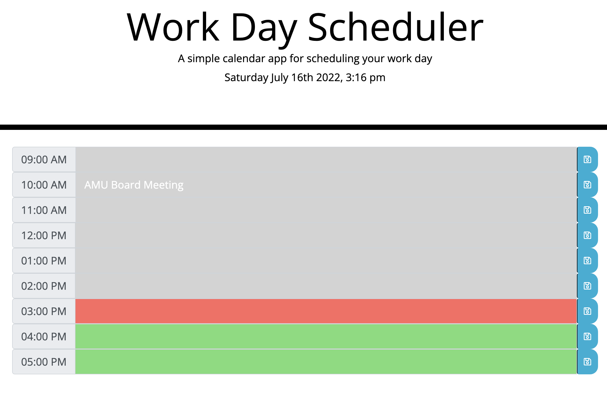

## Work Day Scheduler

This calendar app is responsible for saving events for each hour of the work day. The calendar is color-coded to indicate whether the time is in the past, present or future. 

## Technology Used

* Javascript
* HTML
* CSS

## Preview

  

<a href= ""> Deployed Link on GitHub</a>
